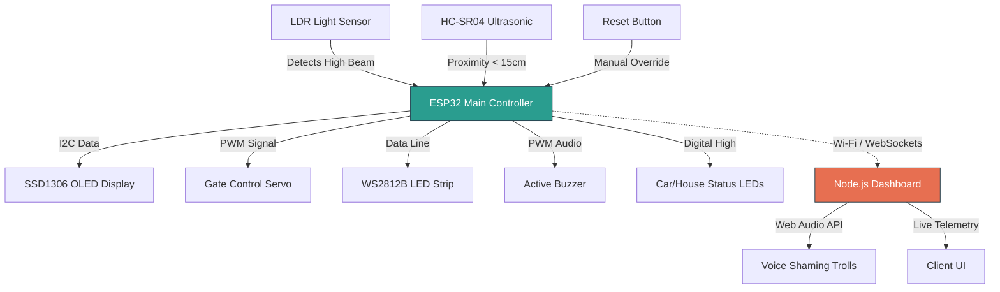

# High Beam Karma Enforcer 🎯

## Basic Details
### Team Name: Xfour

### Team Members
- Team Lead: Faheem Musthafa P 
### Project Description
An IoT-powered toll gate system that dynamically calculates a driver's "Karma Score" based on their headlight etiquette, locking them out and publically shaming them via a web dashboard if they use high beams inappropriately.

### The Problem (that doesn't exist)
Drivers using blinding high beams in well-lit traffic suffer zero immediate consequences from the universe. Existing traffic laws fail to address the profound moral failing of temporarily blinding the car in front of you. 

### The Solution (that nobody asked for)
A physical barrier that actively judges your soul. Using an LDR to monitor headlight intensity, the system rapidly drains your digital Karma if you abuse high beams. Drop below the threshold, and the servo gate refuses to open, the LEDs flash aggressive red, a piezo buzzer screams, and a live web dashboard blasts the "Emotional Damage" audio meme until you rethink your life choices.

## Technical Details
### Technologies/Components Used
**For Software:**
- **Languages:** C++ (Arduino Core), JavaScript, HTML, CSS
- **Frameworks:** Node.js (WebSockets)
- **Libraries:** Adafruit GFX, Adafruit SSD1306, FastLED, ESP32Servo
- **Tools:** Wokwi Simulator, VS Code, PlatformIO

**For Hardware:**
- **Main Components:** ESP32 DevKit V4, HC-SR04 Ultrasonic Sensor, LDR (Photoresistor), WS2812B LED Strip (13 pixels), Servo Motor, SSD1306 OLED Display, MQ-2 Gas Sensor, Piezo Buzzer, Push Button, Standard LEDs (Red/Green).
- **Specifications:** 5V logic for actuators/sonar, 3.3V logic for I2C and sensors.
- **Tools Required:** Wokwi / Breadboard, Jumper Wires, Micro-USB Cable.

### Implementation
**For Software:**
#### Installation
```bash
# Clone the repository
git clone https://github.com/FM9447/useless_project_temp.git
cd useless_project_temp

# Install Node.js dependencies for the web dashboard and audio shaming
npm install express ws serialport
```

#### Run
```bash
# 1. Start the Web Dashboard server
node server.js

# 2. Hardware Simulation
# Open diagram.json in Wokwi or use the VS Code Wokwi extension to launch the ESP32 simulation.
# 3. Open index.html in a browser to view live telemetry.
```

## Project Documentation
### For Software:
**Screenshots (Add at least 3)**
- Live web dashboard showing Karma score and manual override slider.
- ESP32 serial monitor logging real-time telemetry and WebSocket connection.
- Dashboard state when Karma drops below -84.0 and the system enforces lockout.

**Diagrams**

*Software architecture detailing hardware interrupt triggers and WebSocket telemetry pipeline.*

### For Hardware:
**Schematic & Circuit**
image\Screenshot 2026-09-13 054256.png

**Hardware Schematic & Pin Mapping**
| ESP32 Dev Board | Component | Component Pin | Voltage Logic |
| :--- | :--- | :--- | :--- |
| GPIO 21 (SDA) | OLED Display | SDA | 3.3V |
| GPIO 22 (SCL) | OLED Display | SCL | 3.3V |
| GPIO 5 | HC-SR04 Sonar | TRIG | 5V |
| GPIO 18 | HC-SR04 Sonar | ECHO | 5V |
| GPIO 19 | Servo Motor | PWM / Signal | 5V Pwr / 3.3V Sig |
| GPIO 4 | WS2812B LEDs | DIN (Data In) | 5V |
| GPIO 32 | LDR (Photoresistor) | AO (Analog Out) | 3.3V |
| GPIO 26 | Piezo Buzzer | Signal (+) | 3.3V |
| GPIO 27 | Reset Button | Terminal 1 | Active Low |

*Netlist outlining pin mapping and voltage logic for all peripherals.*

### Build Photos
- *image/68265.jpg
 (image/68266.jpg)
 C:\Users\fm944\OneDrive\Desktop\useless project\image\68267.jpg

### Project Demo
**Video**https://drive.google.com/file/d/14-zGdljgPRgKyV_i5CVHkrQCFiTtD5dj/view?usp=sharing
*A walkthrough of the simulation detecting a vehicle, triggering a high beam penalty, dropping the gate, and playing the web audio.*


## Team Contributions
- **Faheem Musthafa P:** Hardware logic, WebSocket integration, C++ firmware, logic flow.


---
Made with ❤️ at TinkerHub Useless Projects
